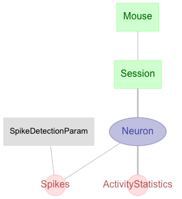

# Tutorial pipeline for Python

This pipeline is based on the Python tutorial documents available at:

  https://tutorials.datajoint.io/

with data available from:

  https://tutorials.datajoint.io/_downloads/python-data.zip

## Tutorial Schema

## Obtain credentials

If you need a database account to try these examples, you can get a free
tutorial account by subscribing through https://datajoint.io.

Before you start working with the pipeline, please obtain the following
credentials:

* host address
* user name 
* password

# Setup

The instructions for downloading the DataJoint library are available here:

http://docs.datajoint.io/setup/Install-and-connect.html

Be sure to set your PYTHONPATH variable accordingly so that the
code here is included in sys.path. For example, 'cd' into this
directory to start the interpreter, or can add it from within python
as follows:

    >>> import sys
    >>> import os
    >>> sys.path.insert(0, '/the/path/to/the/code')  # or. e.g 'C:\tutorial'

# Support

Please submit issues and questions through the [Issues tab
above](https://github.com/datajoint-tutorial)
